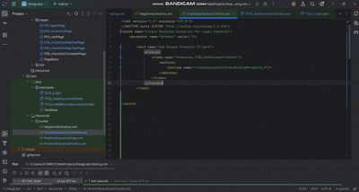

# SwagLabs

SwagLabs is an E-commerce platform showcasing features like product browsing, shopping cart, and checkout processes for apparel, accessories, and swag merchandise.
## Table of Contents

- [Introduction](#introduction)
- [Features](#features)
- [Installation](#installation)
- [Usage](#usage)
- [Contributing](#contributing)
- [License](#license)

## Introduction
SwagLabs is a modern E-commerce application built to deliver a seamless online shopping experience for swag merchandise including clothing, gear, and accessories. This repository contains the complete source code for the SwagLabs project, which can be run locally for development, testing, or demo purposes.
## Features
- **Product Browsing**: View and search a wide range of electronic products like mobiles, laptops, and accessories.
- **Shopping Cart**: Add, update, or remove items from the cart with real-time total calculation.
- **Checkout Process**: Complete your purchases with a smooth and secure checkout flow.
- **User Authentication**: Register, log in, and manage user profiles securely.
- **Admin Dashboard**: Manage products, categories, and orders via an intuitive admin interface.
- **Responsive Design**: Fully responsive UI optimized for desktops, tablets, and mobiles.

## Installation
To set up the SwagLabs application locally, follow these steps:

 1. Clone the repository
* git clone https://github.com/SalmaMamdouh12/SwagLabs.git

2. Navigate to the project directory:
*   cd SwagLabs

3. Install dependencies:
*   npm install

4. Configure the application:
* Update configuration files with necessary settings.

5. Run the application:
*   npm start

## Usage
* User Guide: Refer to the User Guide for detailed information on how to use the SwagLabs application.

## 

## Contributing
* We welcome contributions from the community. To contribute to SwagLabs, follow these steps:
1. Fork the repository.
2. Create a new branch for your feature or bug fix.
3. Make your changes with clear commit messages.
4. Push your changes and open a Pull Request.
5. Please follow the existing code style and include tests where applicable.

## License
* SwagLabs is licensed under the MIT License. See the LICENSE file for more details.